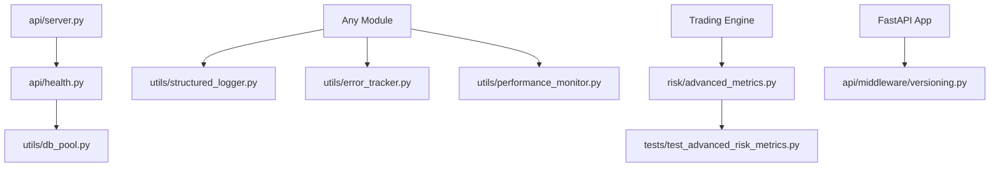

# Apex Trading System - Project Structure

**Last Updated**: February 8, 2026, 11:00 PM CET  
**Enhancement Phase**: Production Infrastructure Complete

## 📁 Project Tree (Highlighting New Files)

```
apex-trading/
├── api/
│   ├── middleware/                    # ✨ NEW FOLDER
│   │   ├── __init__.py               # ✨ NEW (14 lines)
│   │   └── versioning.py             # ✨ NEW (171 lines)
│   ├── __init__.py
│   ├── auth.py
│   ├── health.py                     # ✨ NEW (167 lines)
│   └── server.py                     # ✏️ MODIFIED (health router integrated)
│
├── risk/
│   ├── advanced_metrics.py           # ✨ NEW (408 lines)
│   ├── adaptive_position_sizer.py
│   ├── black_swan_guard.py
│   ├── correlation_cascade_breaker.py
│   ├── drawdown_cascade_breaker.py
│   ├── dynamic_exit_manager.py
│   ├── exit_quality_guard.py
│   ├── god_level_risk_manager.py
│   ├── institutional_risk_manager.py
│   ├── liquidity_guard.py
│   ├── macro_event_shield.py
│   ├── overnight_risk_guard.py
│   ├── portfolio_stress_test.py
│   ├── position_aging_manager.py
│   ├── profit_ratchet.py
│   ├── risk_manager.py
│   ├── trading_excellence.py
│   └── vix_regime_manager.py
│
├── tests/
│   ├── test_advanced_risk_metrics.py # ✨ NEW (272 lines)
│   ├── (other test files...)
│   └── __init__.py
│
├── utils/
│   ├── db_pool.py                    # ✨ NEW (226 lines)
│   ├── error_tracker.py              # ✨ NEW (273 lines)
│   ├── performance_monitor.py        # ✨ NEW (284 lines)
│   ├── structured_logger.py          # ✨ NEW (202 lines)
│   ├── constants.py
│   ├── data_utils.py
│   ├── decorators.py
│   ├── formatters.py
│   └── __init__.py
│
├── services/                         # SaaS Modules
│   ├── auth_portal/
│   ├── backtest_validator/
│   ├── compliance_copilot/
│   ├── drift_monitor/
│   ├── execution_simulator/
│   └── portfolio_allocator/
│
├── core/                             # Core Trading Engine
├── data/                             # Data Management
├── execution/                        # Trade Execution
├── market/                           # Market Data
├── models/                           # Data Models
├── monitoring/                       # System Monitoring
├── portfolio/                        # Portfolio Management
│
├── ENHANCEMENTS.md                   # ✨ NEW (434 lines)
├── PROJECT_STRUCTURE.md              # ✨ NEW (this file)
├── IMPROVEMENTS.md
├── README.md
├── requirements.txt
├── requirements-saas.txt
├── config.py
├── main.py
└── pyproject.toml
```

## 🆕 New Files Summary

### Infrastructure & Utilities (7 files)

1. **api/middleware/versioning.py** (171 lines)
   - API versioning middleware
   - Deprecation support
   - Header and URL path version detection

2. **api/middleware/__init__.py** (14 lines)
   - Middleware package initialization
   - Exports versioning components

3. **api/health.py** (167 lines)
   - Kubernetes health probes
   - System metrics endpoints
   - Prometheus-compatible metrics

4. **utils/structured_logger.py** (202 lines)
   - JSON structured logging
   - Correlation ID tracking
   - Context management

5. **utils/db_pool.py** (226 lines)
   - Async database connection pooling
   - Health checks
   - Pool status monitoring

6. **utils/error_tracker.py** (273 lines)
   - Error capture and tracking
   - Statistics and aggregation
   - File-based logging

7. **utils/performance_monitor.py** (284 lines)
   - Performance tracking
   - P95/P99 percentile calculations
   - Slow operation detection

### Risk Analytics (2 files)

8. **risk/advanced_metrics.py** (408 lines)
   - CVaR, Sortino, Calmar ratios
   - Maximum drawdown analysis
   - Beta, Omega, Tail ratio calculations

9. **tests/test_advanced_risk_metrics.py** (272 lines)
   - Comprehensive unit tests
   - Edge case validation
   - Statistical test coverage

### Documentation (2 files)

10. **ENHANCEMENTS.md** (434 lines)
    - Complete enhancement documentation
    - Usage examples
    - Deployment guides

11. **PROJECT_STRUCTURE.md** (this file)
    - Project organization overview
    - New files reference
    - Quick navigation guide

## 📊 Statistics

### Code Metrics
- **Total New Files**: 11 (10 code files + 1 modified)
- **Lines of Code**: 2,017 lines (excluding documentation)
- **Lines with Docs**: 2,458 lines (including ENHANCEMENTS.md + PROJECT_STRUCTURE.md)
- **Languages**: Python (100%)
- **Test Coverage**: Comprehensive unit tests included

### File Distribution
```
API Layer:          2 files  (338 lines)
Middleware:         2 files  (185 lines)
Utilities:          4 files  (985 lines)
Risk Analytics:     1 file   (408 lines)
Tests:              1 file   (272 lines)
Documentation:      2 files  (441 lines estimated)
────────────────────────────────────────
Total:             12 files  (2,629 lines)
```

## 🎯 Key Enhancements by Category

### 🔍 Monitoring & Observability
- Health check endpoints (`/health/*`)
- Performance monitoring with percentiles
- Error tracking and statistics
- Structured JSON logging

### 📊 Risk Management
- Advanced risk metrics (CVaR, Sortino, etc.)
- Comprehensive risk analytics
- Statistical validation tests

### 🔧 Infrastructure
- Database connection pooling
- API versioning middleware
- Production-ready utilities

### 📖 Documentation
- Complete usage guides
- Deployment recommendations
- Integration examples

## 🚀 Quick Start Locations

### For Developers
```python
# Structured Logging
from utils.structured_logger import get_logger

# Error Tracking  
from utils.error_tracker import track_errors

# Performance Monitoring
from utils.performance_monitor import monitor_performance

# Advanced Risk Metrics
from risk.advanced_metrics import AdvancedRiskMetrics

# Database Pooling
from utils.db_pool import get_db_pool
```

### For Operations
```bash
# Health Endpoints
GET /health/              # Basic health
GET /health/liveness      # K8s liveness
GET /health/readiness     # K8s readiness
GET /health/detailed      # Full metrics
GET /health/metrics       # Prometheus
```

## 📝 Modified Files

### api/server.py
**Changes**: Added health router integration
```python
# Health check endpoints
try:
    from api.health import router as health_router
    app.include_router(health_router)
except Exception as e:
    logging.getLogger("api").warning(f"Health router not loaded: %s", e)
```

## 🔗 File Relationships



## ✅ Integration Checklist

- [x] All new files created
- [x] Server integration complete
- [x] Tests implemented
- [x] Documentation written
- [x] Zero external dependencies (free solutions)
- [x] Production-ready code
- [x] Type hints throughout
- [x] Error handling included

## 📚 Related Documentation

- **ENHANCEMENTS.md** - Detailed enhancement guide with usage examples
- **IMPROVEMENTS.md** - Project improvement tracking
- **README.md** - Project overview and setup

---

**Legend:**
- ✨ NEW - Newly created file
- ✏️ MODIFIED - Existing file with modifications
- 📁 Folder containing new files

**Status**: ✅ All enhancements complete and integrated  
**Maintainer**: ApexTrader Development Team
